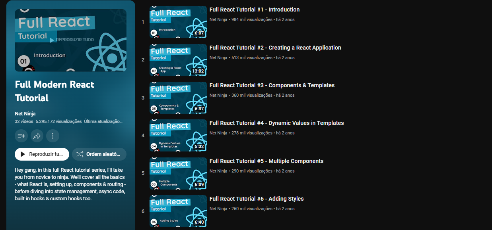

 
 

# Full Modern React Tutorial

https://www.youtube.com/playlist?list=PL4cUxeGkcC9gZD-Tvwfod2gaISzfRiP9d

> In this complete modern React tutorial we'll learn about React from the ground up - setup, JSX templates, components & events. We'll cover state & the use of hooks, the React Router & also how to handle asynchronous code in components.

Project -->  **Blog Example** 
Channel --> **Net Ninja 1,22 mi de inscritos** 
Date Created --> **21 de dez. de 2020**

### Observations
-  create-react-app
-  json-server
-  react-router-dom
-  custom useFetch hook

### components
-  AppMain
   -  NavBar
   -  Home
   -  Create
   -  NotFound
   -  BlogList
      -  BLogDetals
